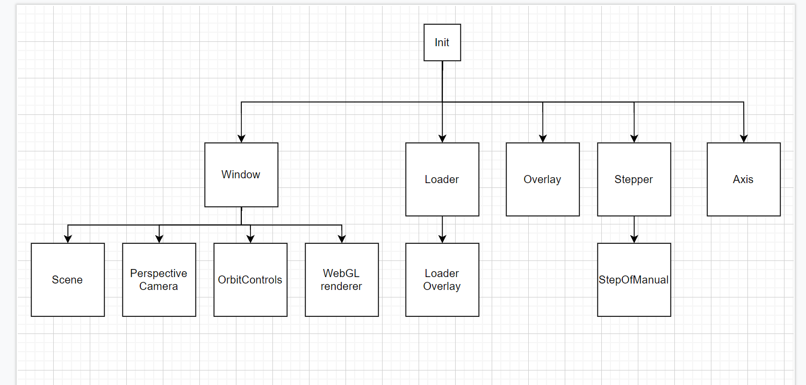

# TIM3D - Three.js Interactive Manual

This repo contains source code for this project.

GitHub Workflows:
* automatically deploys latest push to GitHub pages, 
* builds a documentation based on latest push,
* runs es-lint and prettier checks during pull request

Link to GitHub Pages:
- https://mattjoke.github.io/ThreeJS-library/

Docs:
-  https://mattjoke.github.io/ThreeJS-library/docs

Trello with ToDo (view-only):
- https://trello.com/b/hXZva22f/threejs-library-to-do

## Basic usage

_This usage is subject to change_

    const data = {
        files: [
            {
                file: "models/files/Bar1.stl",
                color: "yellow",
                name: "1",
            },
            {
                file: "models/files/Bar2.stl",
                color: "orange",
                name: "2",
            },
            {
                file: "models/files/Bar3.stl",
                color: "#192833",
                name: "3",
            },
            {
                file: "models/files/Bar4.stl",
                name: "4",
            },
            {
                file: "models/files/Base_gr.stl",
                name: "5",
            }
        ],
        steps: [
            {
                name: "Init",
                positions: [
                    {
                        name: "1",
                        position: new Vector3(10, 10, 10),
                    },
                ],
            },
            {
                name: "First Step",
                positions: [
                    {
                        name: "1",
                        position: new Vector3(7, 7, 7),
                    },
                ],
            },
            {
                name: "Second Step",
                positions: [
                    {
                        name: "1",
                        position: new Vector3(5, 10, 10),
                    },
                ],
            },
        ],
    };

    const config = {
        container: document.getElementById("third"),
        color: "#123456",
    };

    const t2 = new Init(config);
    t2.withJSON(data);

## Classes

Main class the user will interact is currently _Init_ class, this will likely change with added Observer/Factory class.
For more detailed look into classes see [docs](https://mattjoke.github.io/ThreeJS-library/docs).

### High level look at the classes

This image contains basic high-level look on the class scheme (updated 30.9.2021)
